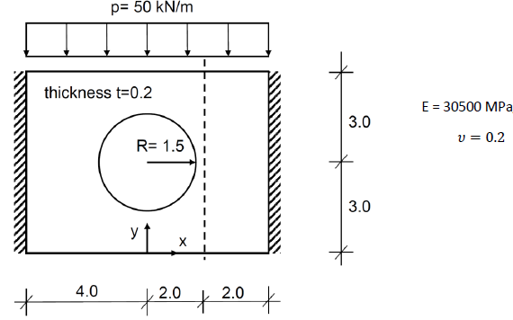
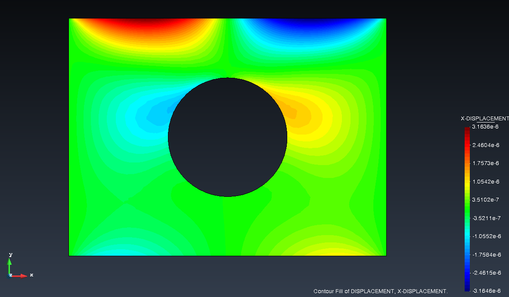
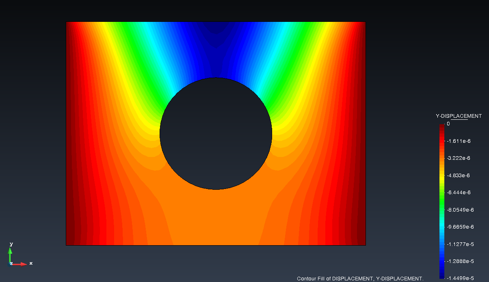
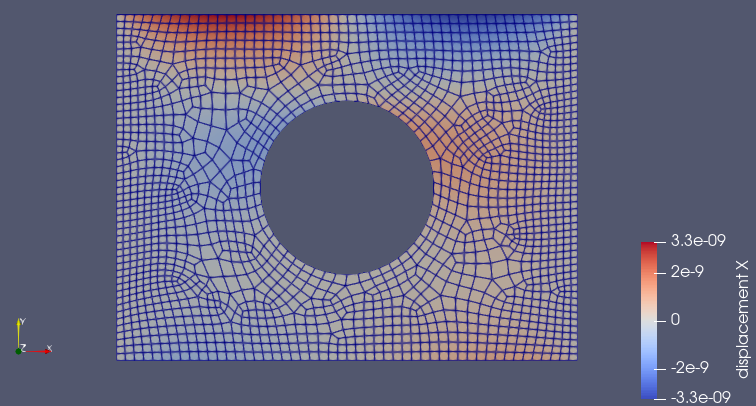
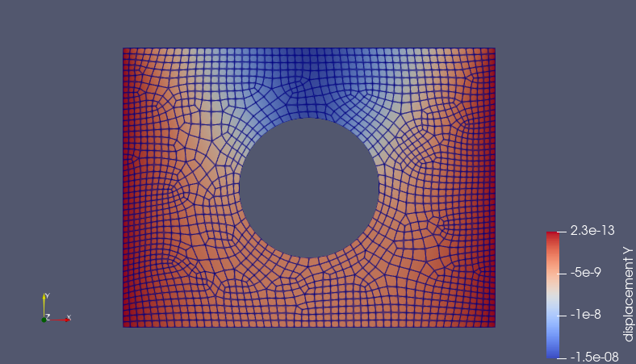

# FEM_SOLVER
This repository contains a simple Finite Element Method solver for solving simple problems (1D and 2D) related to Solid Mechanics. Using it for complicated problems is not recommended. MDPA File is needed to run this code.
-----
This was a part of 2 semester course: Modelling and Simulation held at TU Braunschweig. (SoSe 2024, WiSe 2024/25)
Validation of this code is done with a GiD Software - an Open-Source FEM simulation Software and Kratos Multiphysics.
A specimen was chose with "Plate with a hole".

<table align="center">
 <tr>
    <td align="center">
       
      <b>Figure 1:</b> Problem Statement
    </td>
  </tr>
</table>

  
## Results

### GiD Simulations
------
<table align="center">
  <tr>
    <td align="center">
       
      <b>Figure 2:</b> GID displacement x
    </td>
    <td align="center">
       
      <b>Figure 3:</b> GID displacement y
    </td>
  </tr>
</table>

### FEM SOLVER results
--------
<table align="center">
  <tr>
    <td align="center">
       
      <b>Figure 4:</b> FEM_SOLVER displacement x
    </td>
    <td align="center">
       
      <b>Figure 5:</b> FEM_SOLVER displacement y
    </td>
  </tr>
</table>

## Conclusion
The difference between GiD Software and our code is tangible and maximum $U_x$ is 3.3e-09 m and $U_y$ is 1.5e-08 m.
Relative error comparison shows that maximum displacement in y direction is just 3.45% and for x direction, it is 4.35%, with respect to GiD solver. Due to this negligible error, it is safe to assume that
our FEM solver is performing well. However, we cannot yet conclude that the implemented solver
is flawless. Therefore, more tests are required to validate our solver. Nonetheless, it is safe to say
that our solver passes the solid mechanics test.
